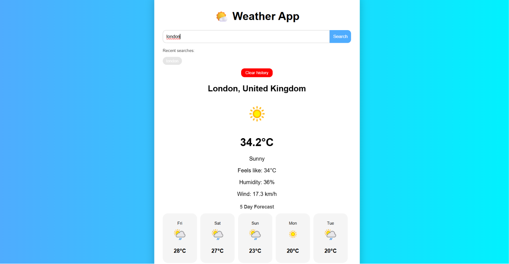

# 🌤️ Weather App

A simple weather application built with React, Node.js and Express. Users can search for any city and view real-time weather information using WeatherAPI.

## ✨ Features

- Search weather by city
- Current temperature
- Humidity
- Wind speed
- Weather condition
- Responsive design

## 🛠️ Technologies

- React
- JavaScript
- CSS
- Node.js
- Express.js
- WeatherAPI

## 📸 Screenshot

## 👩‍💻 Author

Drita Kryeziu
